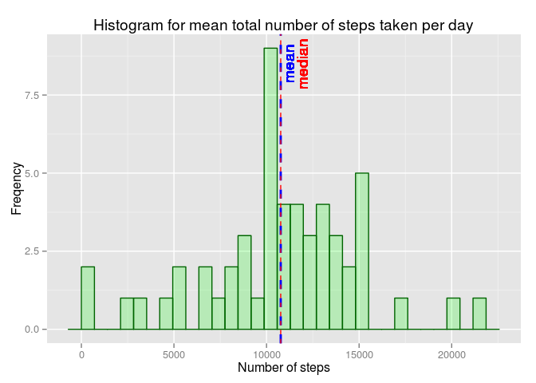

# Reproducible Research: Peer Assessment 1

## Intro

This assignment makes use of data from a personal activity monitoring device.  
The data consists of two months of data from an anonymous individual collected during the months of October and November, 2012 and include the number of steps taken in 5 minute intervals each day.  

    
## Initialisation 

First load the needed libraries / packages & Set the working directory  

```r
    library(ggplot2) # for plotting
    library(dplyr) # for manipulating data 
```

```
## 
## Attaching package: 'dplyr'
## 
## The following objects are masked from 'package:stats':
## 
##     filter, lag
## 
## The following objects are masked from 'package:base':
## 
##     intersect, setdiff, setequal, union
```

```r
    setwd("~/Documents/Machine Learning/reproducible research/RepData_PeerAssessment1")
```

## Loading and preprocessing the data


```r
    activData <- read.csv('activity.csv')
```

## What is mean total number of steps taken per day?


```r
    #activeDays <- activData %>% group_by(as.numeric(as.POSIXct(date, format="%Y-%m-%d"))) %>% summarise(totalSteps=mean(sum(steps)))
    activeDays <- activData %>% group_by(as.Date(date)) %>% summarise(totalSteps=mean(sum(steps)))
    colnames(activeDays) <- c("date", "totalSteps")
    
    histTotalSteps <- ggplot(data=activeDays, aes(x=date, y=totalSteps)) + 
            geom_histogram(stat="identity", 
                        col="dark green", 
                        fill="green", 
                        alpha = .2) + 
            labs(title="Histogram for mean total number of steps taken per day", x="Date", y="Mean total of steps")
    
    print(histTotalSteps)
```

```
## Warning: Removed 8 rows containing missing values (position_stack).
```

 


## What is the average daily activity pattern?


## Imputing missing values


## Are there differences in activity patterns between weekdays and weekends?


